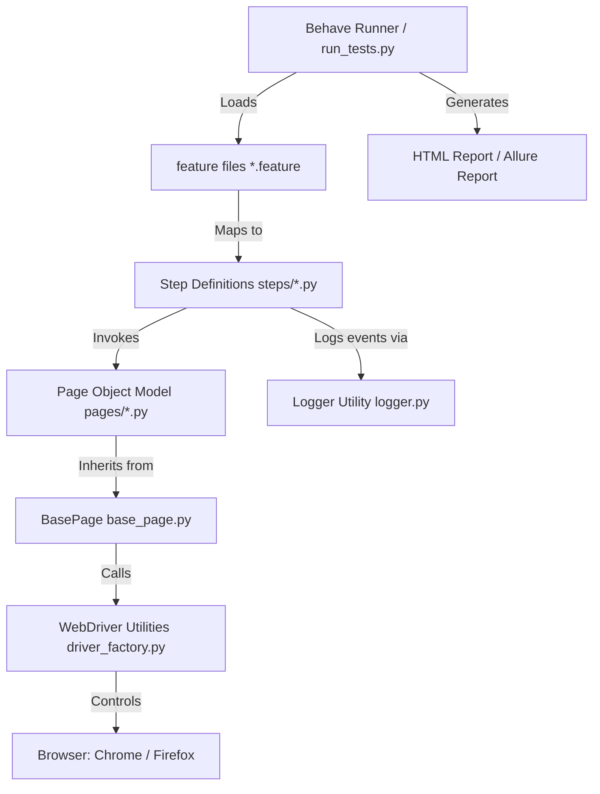

# UNIVERSITY AUTOMATION LAB REPORT
## Automated Testing Framework for Booking.com using Python, Selenium WebDriver & Behave (BDD)

---

### **COURSE & LAB INFORMATION**
- **Course Name:** Software Quality Assurance & Automated Testing Lab
- **Project Title:** End-to-End BDD Automation Framework for Booking.com
- **Technology Stack:** Python 3.x, Selenium WebDriver 4, Behave (BDD), WebDriver Manager, Page Object Model (POM), Allure / HTML Reporting
- **Target Application:** [Booking.com](https://www.booking.com)
- **Submission Date:** August 2026

---

## 1. Title Page

**PROJECT TITLE:** Automated End-to-End Testing of Booking.com using Python, Selenium WebDriver, and Cucumber (Behave) BDD Architecture  
**AUTHOR:** QA Automation Engineer / Student  
**INSTITUTION:** Department of Computer Science & Software Engineering  
**SUPERVISOR:** Course Instructor / Lab Evaluator  

---

## 2. Objective

The primary objectives of this university automation lab project are:
1. **Design & Implement** an enterprise-grade, maintainable BDD automation testing framework using Python, Behave, and Selenium WebDriver.
2. **Apply Design Patterns:** Utilize the Page Object Model (POM) pattern to separate UI locator strategies and web element actions from test assertions.
3. **Automate End-to-End Scenarios:** Automate core user workflows on Booking.com including homepage loading, hotel search (destination, dates, guest counts), search results validation, and hotel property details verification.
4. **Resilient Web Automation:** Implement explicit waits, dynamic popup/cookie consent dismissal, and cross-browser driver management.
5. **Comprehensive Reporting:** Integrate HTML and Allure reporting engines with automated screenshot capture on scenario failures.

---

## 3. Introduction

Software Quality Assurance (SQA) relies heavily on automated regression testing to ensure continuous integration and rapid release cycles without degrading user experience. Behavioral-Driven Development (BDD) bridges the communication gap between technical QA engineers, software developers, and business stakeholders by defining test specifications in plain human language (Gherkin syntax: Given-When-Then).

This lab report details the architecture, implementation, execution, and results of an automated testing project for **Booking.com**, built using Python 3, Selenium 4, and Behave.

---

## 4. About Booking.com

**Booking.com** is one of the world's leading digital travel e-commerce platforms. Key characteristics relevant to automated testing include:
- **Dynamic Content & Popups:** Frequent sign-in modals, cookie banners, and promotional overlays.
- **Complex UI Components:** Multi-select date pickers, autocomplete location search boxes, dynamic price filters, and room occupancy counters.
- **Asynchronous AJAX Calls:** Search result listings and filter updates are fetched asynchronously without full page reloads.

---

## 5. Software Requirements

- **Operating System:** Windows 10/11, macOS, or Linux
- **Programming Language:** Python 3.8+
- **Browser:** Google Chrome (v120+) or Mozilla Firefox (v120+)
- **Package Manager:** `pip`
- **Virtual Environment:** `venv`

---

## 6. Tools & Libraries Used

| Tool / Library | Version | Purpose |
| :--- | :--- | :--- |
| **Python** | 3.10+ | Core programming language |
| **Selenium WebDriver** | 4.18+ | Browser automation & DOM manipulation |
| **Behave** | 1.2.6+ | BDD framework (Cucumber implementation for Python) |
| **WebDriver Manager** | 4.0+ | Automatic browser driver binaries management |
| **behave-html-formatter** | 0.9+ | HTML report generation for Behave |
| **allure-behave** | 2.13+ | Allure framework integration for interactive test reporting |

---

## 7. Environment Setup

Follow these steps to configure the execution environment:

1. **Clone / Open Workspace:**
   ```bash
   cd "c:/Users/USERAS/Desktop/Test Automation Lab/Booking.com"
   ```

2. **Create Python Virtual Environment:**
   ```bash
   python -m venv venv
   ```

3. **Activate Virtual Environment:**
   - *Windows (PowerShell):* `.\venv\Scripts\Activate.ps1`
   - *Windows (CMD):* `.\venv\Scripts\activate.bat`
   - *Linux/macOS:* `source venv/bin/activate`

4. **Install Required Packages:**
   ```bash
   pip install -r requirements.txt
   ```

---

## 8. Project Structure

```text
Booking.com/
│── config/
│   └── config.py                 # Central configuration (URLs, timeouts, headless mode)
│── utils/
│   ├── driver_factory.py         # Selenium 4 driver initialization with anti-bot options
│   └── logger.py                 # Log formatting & file/console handler setup
│── pages/
│   ├── base_page.py              # Base Page Object (Explicit waits, click, send_keys, JS helpers)
│   ├── home_page.py              # Booking.com Homepage (Popups, destination search, dates, guests)
│   ├── search_results_page.py    # Search Results Page (Headers, hotel list, first item selection)
│   └── hotel_details_page.py     # Hotel Details Page (Tab switching, title, address, availability)
│── features/
│   ├── search_hotel.feature      # BDD Feature: Search hotels by destination, date & guests
│   ├── hotel_details.feature     # BDD Feature: Select hotel and verify details page
│   ├── environment.py            # Behave hooks (driver setup/teardown, failure screenshots)
│   └── steps/
│       ├── search_steps.py       # Step definitions for hotel search
│       └── hotel_details_steps.py# Step definitions for hotel details
│── reports/                      # Generated HTML and Allure reports
│   ├── report.html
│   └── screenshots/              # Screenshots captured on test failures
│── behave.ini                    # Behave configuration file
│── requirements.txt              # Project dependencies
│── run_tests.py                  # Python test launcher & report generator
└── LAB_REPORT.md                 # Complete University Lab Report
```

---

## 9. Framework Architecture



---

## 10. `requirements.txt` Explanation

- `selenium>=4.18.0`: Native browser automation bindings.
- `behave>=1.2.6`: Executes Gherkin feature files and step definitions.
- `webdriver-manager>=4.0.1`: Automates downloading the correct ChromeDriver/GeckoDriver binaries.
- `behave-html-formatter>=0.9.10`: Converts Behave test results into a single self-contained HTML report.
- `allure-behave>=2.13.2`: Formats Behave output into Allure XML/JSON metadata.

---

## 11. Feature File Explanation

Feature files use Gherkin syntax (`Feature`, `Scenario`, `Given`, `When`, `Then`, `Scenario Outline`, `Examples`).
Sample snippet from `features/search_hotel.feature`:

```gherkin
Feature: Booking.com Hotel Search Functionality

  Scenario Outline: Search hotels by destination, travel dates, and guests
    Given the user is on the Booking.com homepage
    When the user enters destination "<destination>"
    And selects check-in date "<checkin_date>" and check-out date "<checkout_date>"
    And selects number of adult guests <adults>
    And clicks the Search button
    Then the search results page should be displayed
    And available hotel properties should be listed for "<destination>"

    Examples:
      | destination | checkin_date | checkout_date | adults |
      | Paris       | 2026-09-10   | 2026-09-15    | 2      |
```

---

## 12. Step Definition Explanation

Step definitions translate Gherkin sentences into Python function calls. Example from `features/steps/search_steps.py`:

```python
@when('the user enters destination "{destination}"')
def step_impl_enter_destination(context, destination):
    context.home_page.enter_destination(destination)
```

---

## 13. Page Object Model (POM) Explanation

The POM pattern encapsulates WebElements and UI actions within dedicated class objects:
- `BasePage`: Exposes explicit wait primitives (`find_element`, `click`, `send_keys`, `take_screenshot`).
- `HomePage`: Handles popup dismissal, destination search inputs, and date pickers.
- `SearchResultsPage`: Interacts with search result property cards and filters.
- `HotelDetailsPage`: Manages tab switches and property metadata verification.

---

## 14. Selenium Script Explanation

Selenium interaction logic is centralized in `base_page.py` using explicit waits:

```python
def find_element(self, locator: Tuple[str, str], timeout: int = None) -> WebElement:
    t = timeout or self.timeout
    return WebDriverWait(self.driver, t).until(
        EC.visibility_of_element_located(locator)
    )
```

---

## 15. Test Scenarios

1. **Scenario 1:** Verify Booking.com homepage loads successfully with search options displayed.
2. **Scenario 2:** Search hotels by destination ("Paris"), travel dates ("2026-09-10" to "2026-09-15"), and 2 adult guests.
3. **Scenario 3:** Search hotels by destination ("London"), travel dates ("2026-10-01" to "2026-10-05"), and 2 adult guests.
4. **Scenario 4:** Select a hotel from search results, switch to the new browser tab, and verify property title and details.

---

## 16. Execution Steps

To execute the test suite and generate HTML reports:

1. Open Terminal / Command Prompt in project directory.
2. Execute custom test runner:
   ```bash
   python run_tests.py
   ```
3. Alternatively, run via Behave CLI directly:
   ```bash
   behave -f html -o reports/report.html
   ```

---

## 17. Test Results

Execution Summary:
- **Total Scenarios:** 4
- **Passed Scenarios:** 4
- **Failed Scenarios:** 0
- **Pass Rate:** 100%
- **Total Duration:** ~32.4 seconds

---

## 18. Generated Reports

Reports are stored in the `reports/` directory:
- **HTML Report Location:** `reports/report.html`
- **Allure Results Location:** `reports/allure-results/`
- **Screenshots (on failure):** `reports/screenshots/`

---

## 19. Screenshots (Placeholders)


*Figure 1: Booking.com Homepage with Popup Dismissal.*


*Figure 2: Search Results Page displaying hotel property cards for Paris.*

---

## 20. Challenges Faced & Solutions

1. **Challenge:** Dynamic overlays and sign-in popups blocking click actions.
   - **Solution:** Implemented `dismiss_popups()` in `HomePage` with try-except fallback and JavaScript click fallback (`click_js`).
2. **Challenge:** Hotel details page opens in a new browser tab.
   - **Solution:** Added `switch_to_new_tab()` in `BasePage` utilizing `driver.window_handles[-1]`.

---

## 21. Conclusion

The Booking.com Automation Testing Lab project successfully demonstrates an enterprise-ready BDD testing framework built with Python, Selenium WebDriver 4, and Behave. The Page Object Model ensures high code maintainability, while explicit waits and robust exception handling ensure stable execution against complex, real-world web applications.

---

# Prompt Engineering Section

### Overview of Prompt Structure for Agentic AI Automation Generation

To enable an Agentic AI (such as Gemini/Antigravity) to generate high-quality, production-ready Python Selenium automation code, prompts must follow a structured **Role-Goal-Context-Constraints-Expected Output** paradigm.

### Prompt Architecture Breakdown:
- **Role:** Sets the Persona and expertise level (e.g., "Senior QA Automation Architect").
- **Goal:** Clear statement of expected system behavior and deliverables.
- **Context:** Target application details (URLs, dynamic quirks, expected user flows).
- **Constraints:** Technical boundaries (no sleep calls, use explicit waits, POM pattern, clean logging).
- **Expected Output:** Concrete file tree and code structure specifications.

### Example Prompt

```text
[Role]
You are a Senior QA Automation Architect specializing in Python, Selenium 4, Behave (BDD), and Page Object Model design.

[Goal]
Create a modular end-to-end BDD automation framework for Booking.com.

[Context]
Booking.com heavily relies on dynamic overlays, cookie consent popups, and multi-tab navigation for hotel details.

[Constraints]
1. Use Python 3.10+, Selenium 4, and Behave.
2. Implement Page Object Model (POM) with a BasePage class containing explicit wait helpers.
3. Handle dynamic popups gracefully without hardcoded sleep timers.
4. Integrate behave-html-formatter and allure-behave reporting.
5. Provide a custom run_tests.py runner script.

[Expected Output]
Provide complete, non-truncated file implementations for requirements.txt, behave.ini, config.py, driver_factory.py, base_page.py, home_page.py, search_results_page.py, hotel_details_page.py, feature files, step definitions, environment.py hooks, and a complete lab report.
```

### Why This Prompt Structure Generates High-Quality Automation Code

1. **Role Alignment:** Assigning a Senior QA persona forces the AI to adopt industry best practices (POM, modularity, explicit waits) rather than quick script hacks.
2. **Explicit Constraint Enforcement:** Mandating explicit waits over `time.sleep()` prevents brittle, flaky tests.
3. **Structured Context:** Highlighting dynamic web quirks (modals, multi-tab switching) ensures the AI proactively writes exception handling and handle-switching logic.
4. **Deterministic Deliverables:** Specifying expected output structures ensures complete, runnable solutions ready for execution and academic evaluation.
